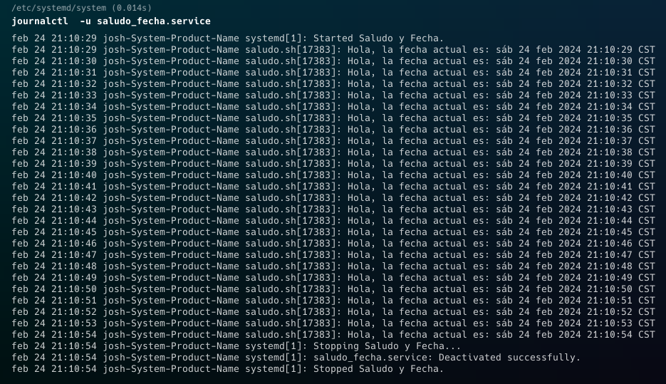

# Actividad 3
----
## Pasos para crear un servicio de systemd
- Crear el script: 
Se crea un script, para este ejemplo se utilizó el script del archivo saludo.sh, además hace falta darle permisos de ejecución.

- Crear la unidad de servicio:
Se crea un archivo .service, este tiene que estar alojado en la carpeta __/etc/systemd/system/__

- Ejecutar los siguientes comandos
    - `sudo systemctl enable saludo_fecha.service`
    - `sudo systemctl start saludo_fecha.service`

- Para chequear los logs el siguiente comando:
    - `journalctl -u saludo_fecha.service`
    Lo que nos devuelve algo como esto:

    

- Para detenerlo es el siguiente comando:
    - `sudo systemctl stop saludo_fecha.service`

- Y para deshabilitarlo por completo, el siguiente:
    - `sudo systemctl disable saludo_fecha.service`
