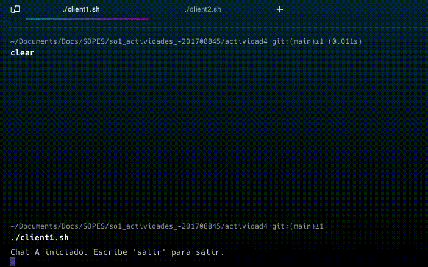

# Chat Basico con Named Pipes

Un chat que consta de 2 participantes que se comunican usando scripts bash, y Named Pipes.


## Crear Pipes

Al inicio de los scripts, se comprueba si existen los named pipes y si no se crean.

## Recepción de mensajes

Se utiliza tail para escuchar constantemente los mensajes 
```bash
  tail -f
```

## Envío de mensajes 

Permite escribir mensajes que se envían al pipe del otro usuario, y además se comprueba si el usuario desea salir del chat.

## Cerrar chat

Al salir el chat, se eliminan los pipes

## Demo



