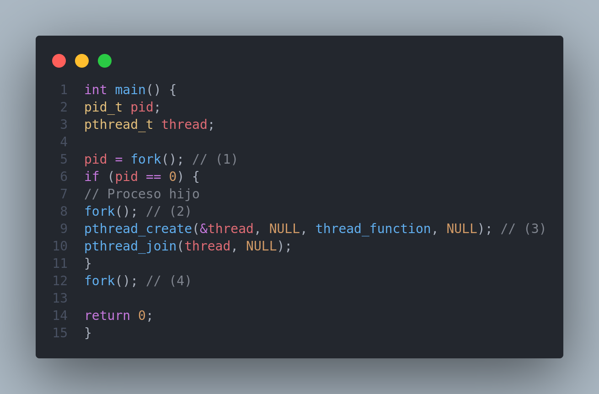

# Actividad 5

## Codigo

## 

- ¿Cuántos procesos únicos son creados?
    - La primera llamada a fork() (1) crea un proceso hijo. Ahora hay              dos procesos: el proceso padre y el proceso hijo.
    - Dentro del proceso hijo, se llama nuevamente a fork() (2), creando un nuevo proceso hijo. Ahora hay tres procesos: el proceso padre, el proceso hijo original, y el nuevo proceso hijo.
    - Finalmente, la última llamada a fork() (4) en el proceso padre crea un cuarto proceso hijo.

- ¿Cuántos hilos únicos son creados?
    - Sólo se crea un hilo único mediante la llamada a pthread_create() (3) dentro del proceso hijo original.

